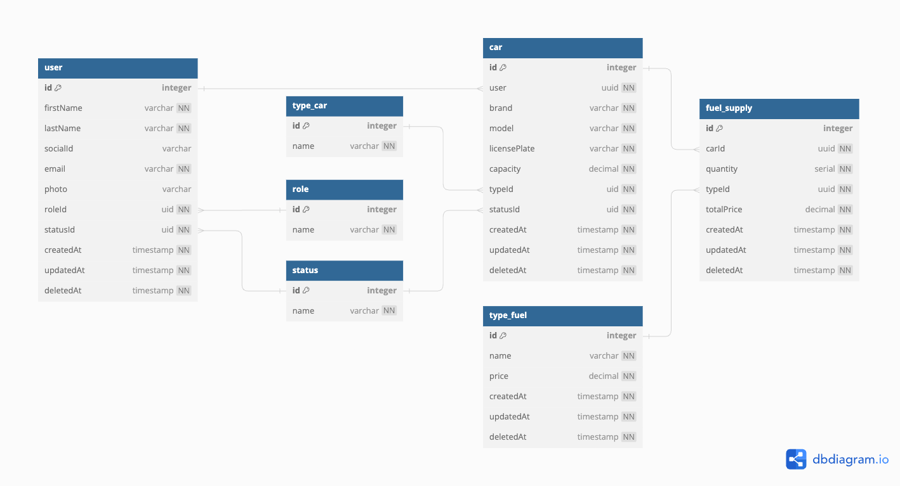
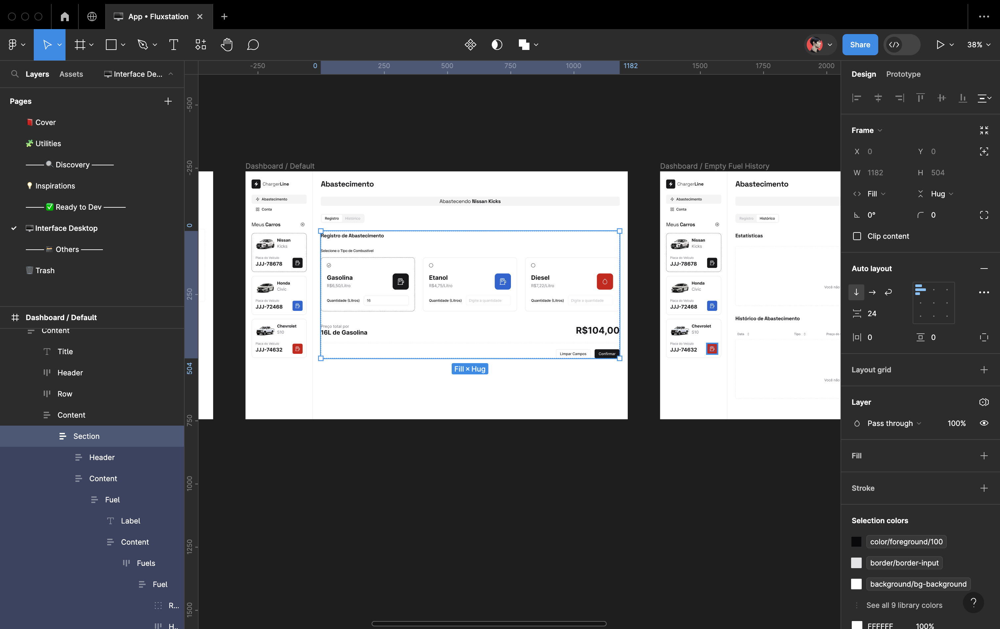
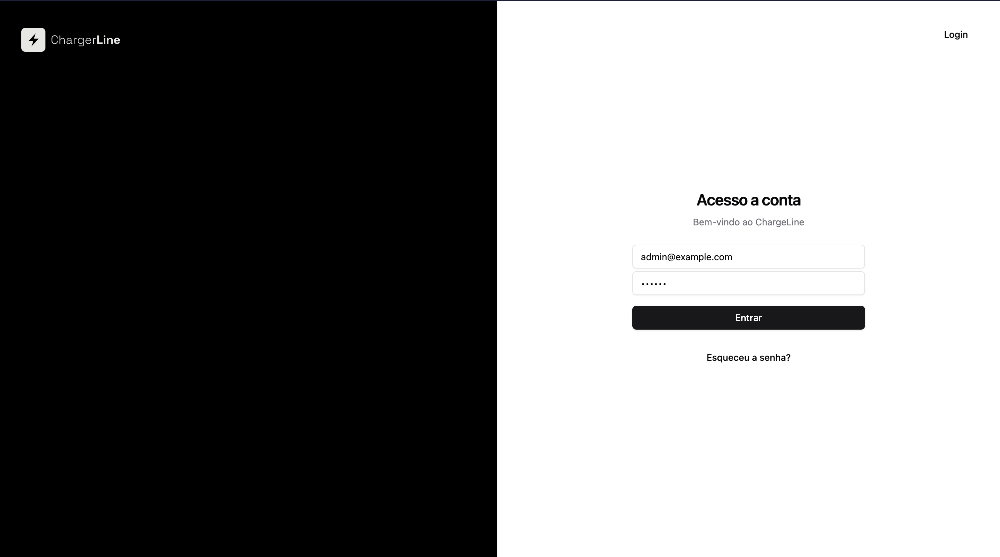
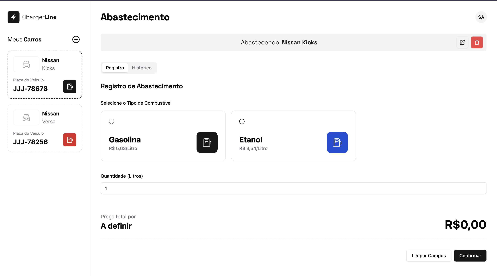
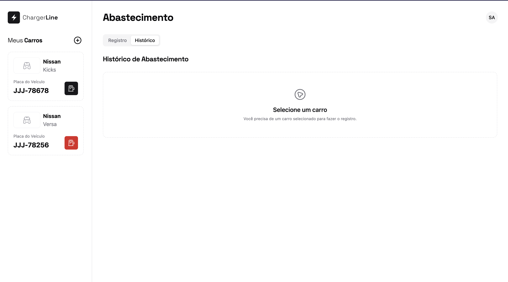
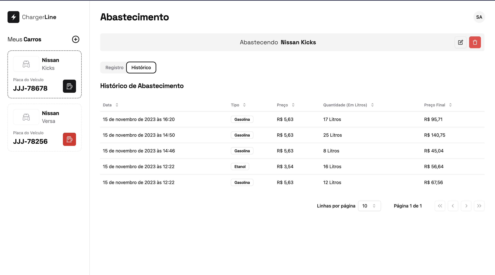
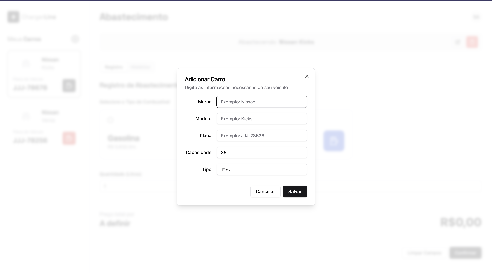
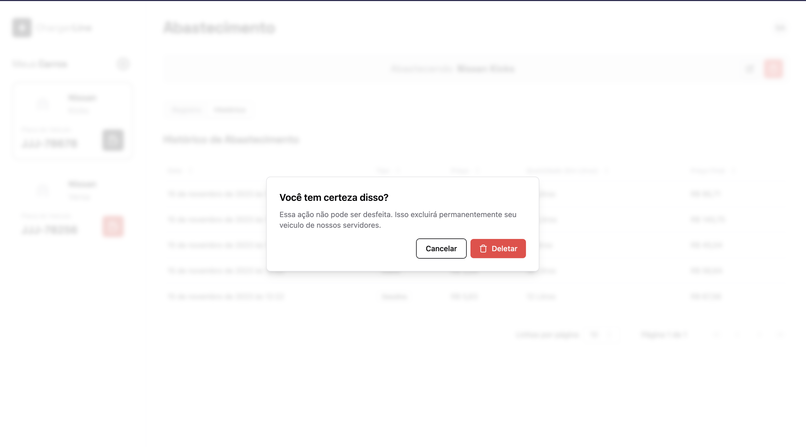

# ChargeLine

Nosso projeto para gestão de combustíveis.

## Stack utilizada

**Front-end:** React, NextJS, TailwindCSS, RadixUI, Shadcn/UI, Zod, React Hook Form, SWR

**Back-end:** Node, NestJS, Jest, Docker

**Banco de Dados:** TypeORM, PostgreSQL

## Processo

Comecei modelando o banco de dados seguindo os requisitos funcionais como base e adicionando algumas tabelas que achei necessária.


[Acesse o diagrama](./docs/db.dmbl)

Em seguida criei um Design no Figma para o projeto para poder visualizar melhor o funcionamento do sistema, utilizei algumas bibliotecas e tokens como TailwindCSS e Shadcn/UI.


[Acesse o Figma](https://www.figma.com/file/aRxRfK4EWf6muUNq5Vu60c/%F0%9F%96%A5%EF%B8%8F-App-%E2%80%A2-Fluxstation?type=design&node-id=505%3A9368&mode=design&t=enqLdTvo1YpKXlKl-1)

## Documentação

[Backend](./backend/README.md)
[Frontend](./frontend/README.md)

## Instalação

Instale chargeline com `bun`

```bash
curl -fsSL https://bun.sh/install | bash

git clone git@github.com:hayatojpg/chargeline.git
```

# Rodando localmente

## Rodar Back-end

```bash
cd chargeline/backend

cp env-example .env
docker compose up -d
```

Rodando localmente em [http://localhost:3001/api/v1](http://localhost:3001/api/v1)
Swagger em [http://localhost:3001/docs](http://localhost:3001/docs)

## Rodar Front-end

```bash
cd.. && cd frontend

cp .env.example .env

bun install

bun dev
```

Rodando localmente em [http://localhost:3000](http://localhost:3000)

## Telas








## Referência

- [Next.js](https://nextjs.org/docs)
- [TailwindCSS](https://tailwindcss.com/)
- [RadixUI](https://www.radix-ui.com/)
- [Shadcn/UI](https://ui.shadcn.com/)
- [NestJS](https://nestjs.com/)
- [TypeORM](https://www.npmjs.com/package/typeorm)
