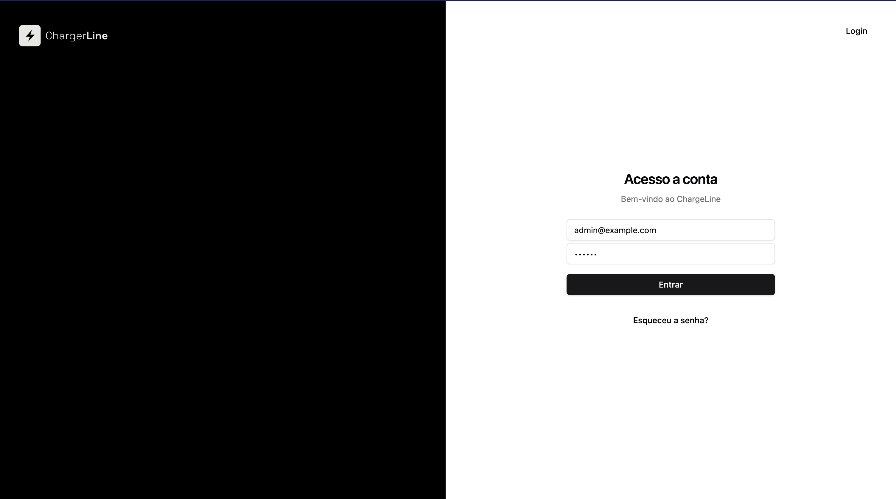
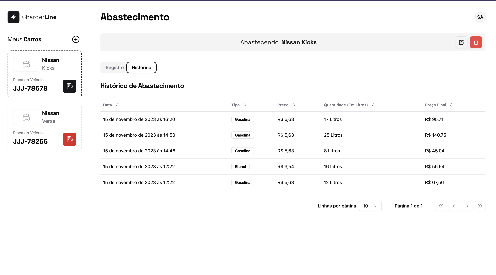

# Frontend

Nosso App para gestão de combustíveis.

## Stack utilizada

**Front-end:** React, NextJS, TailwindCSS, RadixUI, Shadcn/UI, Zod, React Hook Form, SWR

## Instalação

Instale chargeline-frontend com `bun`

```bash
curl -fsSL https://bun.sh/install | bash
```

```bash
git clone git@github.com:hayatojpg/chargeline.git

cd chargeline/frontend
```

## Rodando localmente

```bash
bun install

bun dev
```

Rodando localmente em [http://localhost:3000](http://localhost:3000)

## Telas







## Referência

- [Next.js](https://nextjs.org/docs)
- [TailwindCSS](https://tailwindcss.com/)
- [RadixUI](https://www.radix-ui.com/)
- [Shadcn/UI](https://ui.shadcn.com/)
